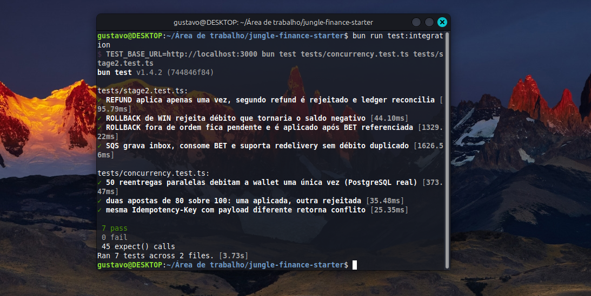
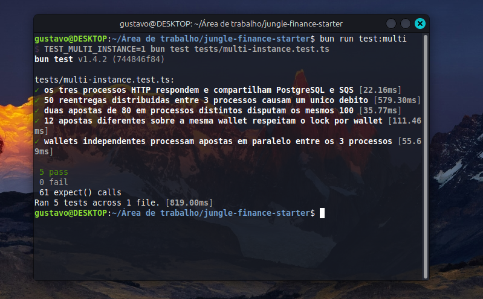
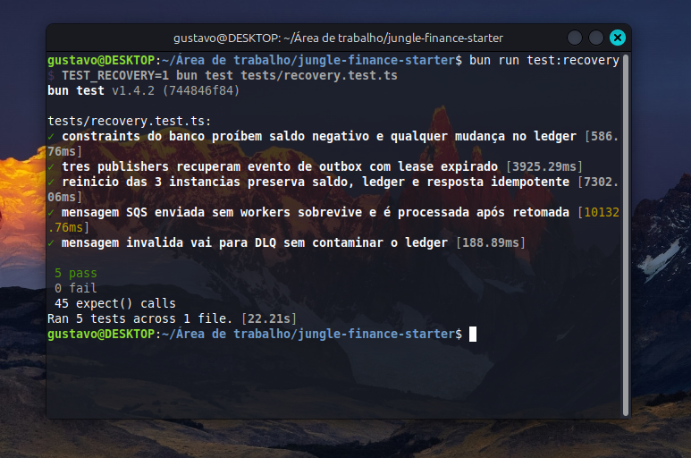
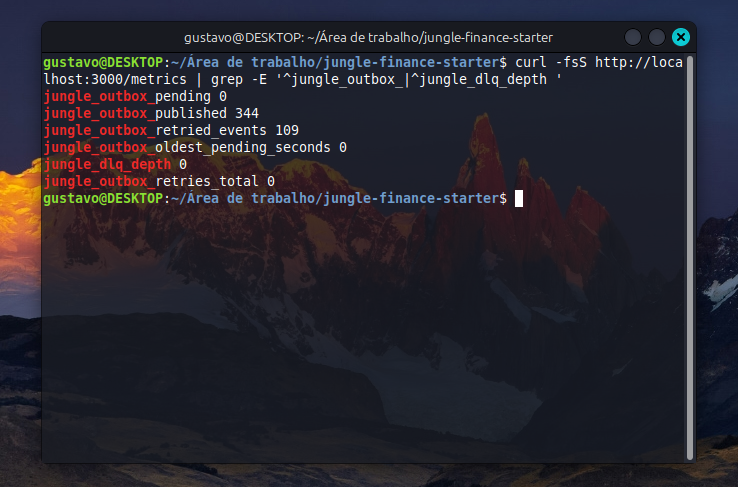

# Jungle Finance

Serviço financeiro distribuído para processamento de operações de apostas recebidas de múltiplos provedores.

**Stack:** NestJS · TypeScript (`strict`) · Bun 1.x · TypeORM · PostgreSQL · AWS SQS (emulado com LocalStack) · Docker Compose.

## Status da validação

**Última validação informada: 08/10/2026**, em Linux Mint. Foram executados com sucesso **24 testes**: 7 unitários, 7 de integração financeira/SQS, 5 envolvendo três instâncias concorrentes e 5 de recuperação. O comando `bun run typecheck` terminou sem erros e o endpoint `/metrics` respondeu no ambiente local.

Após recuperar uma falha de publicação, uma consulta operacional registrou **128 eventos publicados e 0 pendentes na outbox**. Esses números são uma fotografia daquele ambiente de testes, não valores esperados numa instalação nova.

## Pré-requisitos

- Docker Engine (ou Docker Desktop) com o plugin Docker Compose (`docker compose`).
- Bun 1.x para executar os testes localmente. A aplicação usa Bun também no container.
- Portas disponíveis: `3000`, `4566`, `5433`; para três instâncias, também `3001` e `3002`.

> A porta `5433` é a porta **no host** para o PostgreSQL do Compose; internamente os containers se comunicam com `postgres:5432`. Ajuste a porta publicada caso ela também esteja ocupada.

## Iniciar a aplicação

Na raiz do projeto:

```bash
docker compose up -d --build
docker compose ps -a
docker compose logs --tail=80 api
```

O serviço `migrate` é um job de execução pontual durante a subida; ele termina com código `0` após executar as migrations pendentes. Não é necessário executar migrations em cada réplica da API.

Verifique os endpoints:

```bash
curl -i http://localhost:3000/health/live
curl -i http://localhost:3000/health/ready
```

`/health/live` retorna `{"status":"ok"}`. A resposta de `/health/ready` é `200` quando PostgreSQL e a fila SQS requerida estão acessíveis; durante a inicialização do LocalStack, ela pode retornar `503`.

## Fluxo de demonstração

### 1. Criar uma wallet de R$ 100,00

A abertura com saldo positivo gera uma operação interna `OPENING` e um lançamento `CREDIT` no ledger, dentro da mesma transação SQL.

No Linux, gere um identificador de jogador novo para evitar conflito ao repetir a demonstração:

```bash
PLAYER_ID="$(cat /proc/sys/kernel/random/uuid)"

curl -sS -X POST http://localhost:3000/wallets \
  -H 'Content-Type: application/json' \
  -d "{\"playerId\":\"$PLAYER_ID\",\"initialBalance\":{\"amount\":\"100.00\",\"currency\":\"BRL\"}}"
```

Copie o `id` retornado e defina uma variável:

```bash
WALLET_ID="COLE_AQUI_O_UUID_RETORNADO"
```

### 2. Processar uma aposta de R$ 80,00

```bash
TX_ID="bet-$(date +%s%N)"

curl -i -X POST http://localhost:3000/wagering/transactions \
  -H 'Content-Type: application/json' \
  -H "Idempotency-Key: provider-a:$TX_ID" \
  -d "{\"providerId\":\"provider-a\",\"externalTransactionId\":\"$TX_ID\",\"playerId\":\"$PLAYER_ID\",\"walletId\":\"$WALLET_ID\",\"roundId\":\"round-1\",\"gameId\":\"game-1\",\"kind\":\"BET\",\"money\":{\"amount\":\"80.00\",\"currency\":\"BRL\"}}"
```

Resultado esperado: transação `PROCESSED` e saldo `20.00 BRL`.

Execute **novamente a mesma requisição** (sem redefinir `TX_ID`): o retorno deve manter o mesmo `transactionId`, saldo observado na primeira execução e `idempotentReplay: true`. Reutilizar a mesma chave com um valor diferente deve produzir `409 IDEMPOTENCY_CONFLICT`.

### 3. Consultar wallet, ledger e reconciliação

```bash
curl -sS "http://localhost:3000/wallets/$WALLET_ID"
curl -sS "http://localhost:3000/wallets/$WALLET_ID/ledger?limit=50"
curl -sS -X POST "http://localhost:3000/wallets/$WALLET_ID/reconciliation"
```

O saldo persistido deve ser `20.00 BRL`, e `consistent` deve ser `true`. A reconciliação utiliza uma fotografia transacional com isolamento `REPEATABLE READ`.

## Testes

Instale as dependências e execute a verificação de tipos e os testes unitários:

```bash
bun install
bun run typecheck
bun run test
```

Para integração com PostgreSQL e SQS emulado pelo LocalStack, deixe o Compose em execução e rode:

```bash
bun run test:integration
```

Para validar três processos distintos, compartilhando as mesmas dependências:

```bash
docker compose --profile concurrency up -d --build
curl -fsS http://localhost:3001/health/live
curl -fsS http://localhost:3002/health/live
bun run test:multi
```

Execute a suíte de recuperação **separadamente**, pois ela interrompe e reinicia temporariamente containers da aplicação:

```bash
bun run test:recovery
```

| Suíte | Comando | Último resultado informado (08/10/2026) |
| --- | --- | ---: |
| Unidade + observabilidade | `bun run test` | 7 aprovados |
| Integração financeira/SQS | `bun run test:integration` | 7 aprovados |
| Concorrência entre três processos | `bun run test:multi` | 5 aprovados |
| Recuperação e falhas | `bun run test:recovery` | 5 aprovados |
| **Total** | | **24 aprovados, 0 falhas** |

> Ao executar `bun run test`, os testes que exigem containers são ignorados intencionalmente; eles são executados pelos comandos específicos acima. Nunca use `docker compose down -v` para simular recuperação: ele remove os volumes, incluindo os dados financeiros.

### Evidências de execução

As evidências abaixo devem ser capturas **reais** do terminal, produzidas no ambiente de desenvolvimento. Elas complementam os testes automatizados: os comandos acima permitem reproduzir os resultados.

<!-- Após adicionar os arquivos indicados a docs/images/, remova os comentários abaixo.







-->

## Observabilidade

```bash
curl -fsS http://localhost:3000/metrics
curl -fsS http://localhost:3001/metrics   # se o perfil concurrency estiver ativo
curl -fsS http://localhost:3002/metrics   # se o perfil concurrency estiver ativo
```

`/metrics` expõe texto no formato Prometheus. Contagem de transações por status, situação da outbox e idade do evento pendente mais antigo são consultadas no PostgreSQL; a profundidade estimada da DLQ vem do SQS. Replays, tentativas de publicação, conflitos de lock e latência são métricas **locais de cada instância** e reiniciam com o processo.

**Na agregação:** não some os gauges derivados do PostgreSQL entre as instâncias, pois cada réplica expõe os mesmos valores.

Os endpoints `/health/live` e `/health/ready` não exigem autenticação.

## API HTTP

| Endpoint | Finalidade |
| --- | --- |
| `POST /wallets` | Cria wallet; saldo inicial positivo gera `OPENING` + ledger |
| `GET /wallets/:walletId` | Consulta saldo e versão |
| `GET /wallets/:walletId/ledger` | Ledger com cursor base64url opaco e ordenação estável |
| `POST /wallets/:walletId/reconciliation` | Compara saldo persistido com saldo reconstruído do ledger |
| `POST /wagering/transactions` | `BET`, `WIN`, `LOSS`, `REFUND`, `ROLLBACK`, idempotência e referências pendentes |
| `GET /wagering/transactions/:transactionId` | Consulta por identificador interno |
| `GET /providers/:providerId/wagering/transactions/:externalTransactionId` | Consulta pelo identificador do provedor |
| `GET /health/live` | Liveness |
| `GET /health/ready` | Readiness (PostgreSQL e SQS) |
| `GET /metrics` | Métricas no formato Prometheus |

Contratos HTTP: `400` para payload inválido, `404` para recurso inexistente, `409` para conflito, `422` para rejeição de negócio (como saldo insuficiente) e `503` para indisponibilidade transitória. Um `POST` processado normalmente retorna `201`; uma operação aguardando referência pode retornar `202`. Consulte `ARCHITECTURE.md` para detalhes das decisões.

## Migrations

A migration inicial está em `src/database/migrations/2026100700000-InitialSchema.ts` e implementa `up` e `down`.

```bash
# Após editar uma migration, reconstruir a imagem:
docker compose build migrate

# Aplicar migrations pendentes (normalmente executadas durante o up):
docker compose run --rm migrate

# Reverter a última migration: DESTRUTIVO; use apenas em ambiente descartável.
docker compose run --rm migrate bun dist/database/revert.js
```

Não use `synchronize: true`.

## Parar os serviços

```bash
# Interromper os serviços mantendo dados e volumes:
docker compose --profile concurrency down

# ATENÇÃO: remove também volumes e dados persistidos; somente em ambiente descartável.
# docker compose --profile concurrency down -v
```

## Decisões e limitações conhecidas

- **Autenticação:** omitida conforme permitido pelo desafio (não pontuada). `NoopAuthGuard` é um ponto explícito de extensão, **não** é proteção real.
- **Entrega:** SQS e outbox operam com semântica *at-least-once*. Após publicação e antes da confirmação no banco, um crash pode gerar publicação duplicada; consumidores devem deduplicar por `eventId`.
- **Idempotência entre wallets diferentes:** a mesma chave usada simultaneamente em wallets distintas pode resultar em conflito de unicidade genérico; o comportamento está documentado em `ARCHITECTURE.md`.
- **Cobertura de falhas:** foram executados testes de reinício, lease expirado e recuperação de mensagens. Não foram injetadas todas as falhas exatamente entre commit e ACK, nem realizada carga com relatório p50/p95/p99.
- **Observabilidade:** alguns contadores são locais ao processo e não persistem após reinício.
- **Dados:** volumes preservam o saldo entre reinícios. Não remova volumes inadvertidamente.

Mais detalhes sobre decisões, trade-offs e riscos em [ARCHITECTURE.md](ARCHITECTURE.md).
